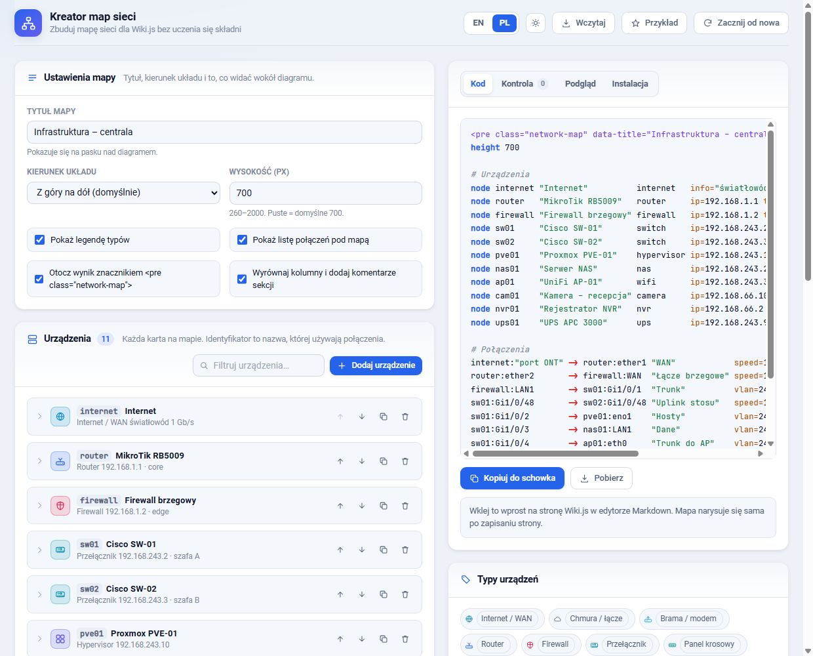
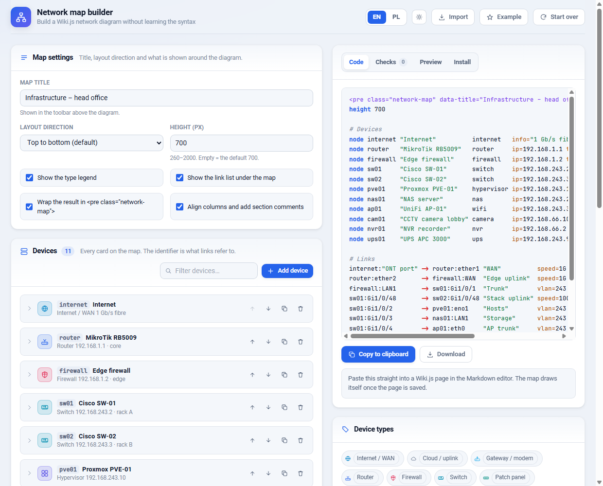

<a name="top"></a>
<div align="center">

<h1 align="center">WikiJS Network Map</h1>

**Interaktywne mapy infrastruktury sieciowej dla Wiki.js, opisywane zwykłym tekstem**<br />
**Interactive network infrastructure diagrams for Wiki.js, written as plain text**


### [🇵🇱 Polski](#polski) · [🇬🇧 English](#english)

</div>

---

## Polski

Jeden blok `<pre class="network-map">` na stronie [Wiki.js](https://js.wiki) i mapa
rysuje się sama — razem z portem po **obu** stronach każdego kabla.

```html
<pre class="network-map" data-title="Mapa infrastruktury głównej">
node router "MikroTik RB5009" router ip=192.168.1.1
node sw01   "Cisco SW-01"     switch ip=192.168.243.2

router:ether1 -> sw01:Gi1/0/48 "Uplink" vlan=243 speed=10G
</pre>
```

### Opis

Zamiast rysować schemat w zewnętrznym programie i wrzucać na wiki obrazek, który
zaraz się zdezaktualizuje, opisujesz urządzenia i połączenia zwykłym tekstem —
wprost w treści strony. Mapa układa się sama, pozwala kliknąć każde urządzenie
i wyszukać je po nazwie, adresie IP albo roli.

Nie ma tu żadnej kompilacji ani zależności do zainstalowania: jeden plik `.js`,
jeden `.css` i biblioteka Cytoscape. Oba foldery językowe zawierają kompletną,
samodzielną kopię skryptu — różnią się wyłącznie językiem interfejsu, komunikatów
i komentarzy, więc wczytujesz ten, który Cię interesuje, a drugi ignorujesz.

### Funkcje

- **Porty po obu stronach połączenia** — `router:ether1 -> sw01:Gi1/0/48`; etykiety
  trzymają się swoich urządzeń i nie nachodzą na siebie
- **Układ bez przecinających się linii** — trasy krawędzi liczy dagre, więc długie
  połączenia omijają urządzenia stojące po drodze, a wiązki (LAG / EtherChannel)
  są rozsuwane zamiast rysowane jedna na drugiej
- **25 typów urządzeń** z własnymi ikonami SVG i kolorami — router, firewall, switch,
  patchpanel, access point, serwer, hypervisor, VM, NAS, macierz, kamera, rejestrator,
  centrala alarmowa, centrala pożarowa, czujnik, UPS, drukarka, telefon i więcej
  (działają też skróty: `fw`, `sw`, `ap`, `pve`, `cctv`, `dvr`, `pc`…)
- **Panel szczegółów** po kliknięciu: każde połączenie jako `port → port`, z opisem,
  VLAN-em, prędkością i notatkami, a jednym kliknięciem przechodzisz na drugi koniec kabla
- **Wyszukiwanie** po nazwie, adresie IP, identyfikatorze, roli i typie
- **Układ pionowy / poziomy**, linie gładkie lub ortogonalne, przełącznik opisów, pełny ekran
- **Jasny i ciemny motyw Wiki.js**, obsługa dotyku i wydruk (pod mapą chowa się tabela
  wszystkich połączeń — przydatna również dla czytników ekranu)
- **Kontrola składni** — mapa zgłasza nieznane typy, połączenia do niezdefiniowanych
  urządzeń i, co najcenniejsze, **ten sam port użyty dwa razy** — i mimo to się rysuje

### Instalacja

Wszystko odbywa się w **Administracja → Wygląd → Wstrzykiwanie kodu**.

```html
<!-- Head -->
<link rel="stylesheet" href="https://cdn.jsdelivr.net/gh/MowMiMazur/WikiJS-Network-map@v1.0.3/pl/network-map.css">
```

```html
<!-- Body -->
<script src="https://cdn.jsdelivr.net/npm/cytoscape@3.34.0/dist/cytoscape.min.js"></script>
<script src="https://cdn.jsdelivr.net/npm/cytoscape-dagre@3.0.0/cytoscape-dagre.js"></script>
<script src="https://cdn.jsdelivr.net/gh/MowMiMazur/WikiJS-Network-map@v1.0.3/pl/network-map.js"></script>
```

Dla interfejsu angielskiego użyj `/en/` zamiast `/pl/`. To cała instalacja —
wstawiasz na stronie wiki blok `<pre class="network-map">…</pre>` i mapa rysuje
się sama.

#### Wersja w adresie

| Adres | Co dostajesz |
|---|---|
| `@v1.0.3` | dokładnie to wydanie, na stałe — nic nie zmieni się pod Twoją wiki, dopóki sam nie poprawisz adresu |
| `@1` | najnowsze `1.x`, przychodzi samo, bez zmian łamiących zgodność |
| `@latest` | najnowsze wydanie w ogóle, także przyszłe `2.x` |

`@1` i `@latest` doganiają nowe wydanie z opóźnieniem do doby, przez cache CDN-u
i przeglądarki; przypięty adres nie ma tego opóźnienia, bo jest po prostu innym
adresem. Co się zmieniło w danej wersji, opisuje
[lista wydań](https://github.com/MowMiMazur/WikiJS-Network-map/releases).

> `raw.githubusercontent.com` tu nie zadziała — serwuje pliki jako `text/plain`
> z `nosniff`, więc przeglądarka odmawia ich wykonania. Cytoscape zawsze bierz
> z jego oficjalnych wydań. GitHub Pages i hosting na własnym serwerze opisuje
> [polska dokumentacja](pl/README.md#instalacja).

### Kreator map

Nie chcesz pisać składni ręcznie? Pobierz **[builder.html](builder.html)** i otwórz
w przeglądarce — jedna strona działająca bez internetu, w której urządzenia,
metadane i połączenia wpisujesz w formularz, widzisz kontrolę poprawności,
podgląd prawdziwej mapy i gotowy blok do skopiowania. Interfejs przełącza się
między polskim a angielskim, potrafi też wczytać mapę, którą już masz na wiki.
Szczegóły: [polska dokumentacja](pl/README.md#kreator-map).



### Wymagania

| Zależność | Wersja |
|---|---|
| Wiki.js | 2.x, z włączonym wstrzykiwaniem kodu |
| [Cytoscape.js](https://github.com/cytoscape/cytoscape.js) | ≥ 3.30 |
| [cytoscape.js-dagre](https://github.com/cytoscape/cytoscape.js-dagre) | ≥ 3.0 |

> W dagre 3.0 pojawiło się `useDagreEdgeControlPoints`, którego mapa potrzebuje,
> żeby prowadzić linie wokół kart urządzeń; sam dagre jest dołączony do tej paczki.
> Kreator map nie wymaga niczego poza przeglądarką.

### Struktura projektu

```
WikiJS-Network-map/
├── builder.html          # Kreator map w formularzu (PL/EN), działa offline
├── en/                   # Wersja angielska — kompletna i samodzielna
│   ├── network-map.js    # Skrypt mapy
│   ├── network-map.css   # Style
│   ├── README.md         # Pełna dokumentacja
│   └── SYNTAX.md         # Opis składni
├── pl/                   # Wersja polska — kompletna i samodzielna
│   ├── network-map.js
│   ├── network-map.css
│   ├── README.md
│   └── SKLADNIA.md
├── preview/              # Zrzuty ekranu, osobny zestaw na język
└── vendor/               # Cytoscape.js + cytoscape-dagre, dla wiki bez dostępu do CDN
```

### Dokumentacja

* [Pełna dokumentacja](pl/README.md) — instalacja we wszystkich wariantach, obsługa
  mapy, konfiguracja skryptu i to, jak działa w środku
* [Opis składni](pl/SKLADNIA.md) — wszystkie polecenia, typy i atrybuty; możesz
  wkleić ten plik jako stronę pomocy we własnej wiki
* [Kreator map](builder.html) — jeśli wolisz formularz od pisania z ręki

### Licencja

Projekt udostępniany na **Licencji Apache 2.0** — możesz go swobodnie używać,
modyfikować i rozpowszechniać, również komercyjnie. W zamian musisz **zachować
informację o autorstwie**: pozostawić noty o prawach autorskich w plikach
`network-map.js` i `network-map.css`, dołączyć plik [NOTICE](NOTICE) do każdej
kopii lub pracy pochodnej oraz oznaczyć wprowadzone przez siebie zmiany.
Szczegóły w pliku [LICENSE](LICENSE).

```
Copyright 2026 Mateusz Mazur (MAZNET)
```

Cytoscape.js i cytoscape.js-dagre są na licencji MIT i pozostają własnością
swoich autorów.

### Autor

**Mateusz Mazur** (MAZNET) · [maznet.pl](https://maznet.pl)

<div align="right"><a href="#top">↑ do góry</a></div>

---

## English

One `<pre class="network-map">` block on a [Wiki.js](https://js.wiki) page and the
map draws itself — including the port on **both** ends of every cable.

```html
<pre class="network-map" data-title="Head office network">
node router "MikroTik RB5009" router ip=192.168.1.1
node sw01   "Cisco SW-01"     switch ip=192.168.243.2

router:ether1 -> sw01:Gi1/0/48 "Uplink" vlan=243 speed=10G
</pre>
```

### Overview

Instead of drawing a diagram in an external tool and uploading a picture that goes
stale the next week, you describe devices and links in plain text — right inside the
page. The map lays itself out, every device is clickable, and you can search it by
name, IP address or role.

There is nothing to compile and nothing to install: one `.js` file, one `.css` file
and the Cytoscape library. Both language folders hold a complete, standalone copy of
the script. The only difference is the language of the interface, the messages and
the comments — load the one you want and ignore the other.

### Features

- **Ports on both ends of a link** — `router:ether1 -> sw01:Gi1/0/48`; each label is
  anchored to its own device and kept from overlapping the others
- **Layout without crossing lines** — edge routes come from dagre, so long links curve
  around the devices that sit between their endpoints, and parallel links
  (LAG / EtherChannel) are spread apart instead of drawn on top of each other
- **25 device types** with their own SVG icons and colours — router, firewall, switch,
  patch panel, access point, server, hypervisor, VM, NAS, storage array, camera, NVR,
  intruder alarm, fire panel, sensor, UPS, printer, phone and more (common
  abbreviations work as aliases: `fw`, `sw`, `ap`, `pve`, `cctv`, `dvr`, `pc`…)
- **Details panel** on click: every link as `port → port`, with descriptions, VLANs,
  speeds and notes; one more click jumps to the device on the other end
- **Search** across name, IP address, id, role and type
- **Vertical / horizontal layout**, smooth or orthogonal lines, description toggle, fullscreen
- **Light and dark Wiki.js themes**, touch support and print-friendly output (a
  collapsible table of every link sits under the map — also useful for screen readers)
- **Syntax checking** — the map reports unknown types, links to undefined devices and,
  most usefully, **the same port used by two links** — and still renders

### Install

Everything happens in **Administration → Theme → Code injection**.

```html
<!-- Head -->
<link rel="stylesheet" href="https://cdn.jsdelivr.net/gh/MowMiMazur/WikiJS-Network-map@v1.0.3/en/network-map.css">
```

```html
<!-- Body -->
<script src="https://cdn.jsdelivr.net/npm/cytoscape@3.34.0/dist/cytoscape.min.js"></script>
<script src="https://cdn.jsdelivr.net/npm/cytoscape-dagre@3.0.0/cytoscape-dagre.js"></script>
<script src="https://cdn.jsdelivr.net/gh/MowMiMazur/WikiJS-Network-map@v1.0.3/en/network-map.js"></script>
```

Use `/pl/` instead of `/en/` for the Polish interface. That is the whole
installation — drop a `<pre class="network-map">…</pre>` block into any wiki page
and the map draws itself.

#### Version in the address

| Address | What you get |
|---|---|
| `@v1.0.3` | exactly this release, for good — nothing changes under your wiki until you edit the address |
| `@1` | the newest `1.x`, arriving on its own, without breaking changes |
| `@latest` | the newest release of any kind, a future `2.x` included |

`@1` and `@latest` trail a new release by up to a day of CDN and browser caching;
a pinned address has no such delay, because it is a different address.
[Releases](https://github.com/MowMiMazur/WikiJS-Network-map/releases) lists what
each version changed.

> `raw.githubusercontent.com` will not work here — it serves `text/plain` with
> `nosniff`, so browsers refuse to execute the files. Cytoscape should always come
> from its own official releases. GitHub Pages and self-hosted setups are covered in
> the [English documentation](en/README.md#installation).

### Map builder

Rather not write the syntax by hand? Download **[builder.html](builder.html)** and
open it in a browser — a single offline page where you fill devices, metadata and
links into a form, watch the checks, preview the real map and copy the finished
block. The interface switches between English and Polish; it can also import a map
you already have on the wiki. Details: [English documentation](en/README.md#map-builder).



### Requirements

| Dependency | Version |
|---|---|
| Wiki.js | 2.x, with code injection enabled |
| [Cytoscape.js](https://github.com/cytoscape/cytoscape.js) | ≥ 3.30 |
| [cytoscape.js-dagre](https://github.com/cytoscape/cytoscape.js-dagre) | ≥ 3.0 |

> dagre 3.0 introduced `useDagreEdgeControlPoints`, which the map needs to route
> lines around device cards; dagre itself is bundled in that package. The map
> builder needs nothing but a browser.

### Project structure

```
WikiJS-Network-map/
├── builder.html          # Form-based map editor (EN/PL), works offline
├── en/                   # English build — complete and standalone
│   ├── network-map.js    # The map script
│   ├── network-map.css   # Styles
│   ├── README.md         # Full documentation
│   └── SYNTAX.md         # Syntax reference
├── pl/                   # Polish build — complete and standalone
│   ├── network-map.js
│   ├── network-map.css
│   ├── README.md
│   └── SKLADNIA.md
├── preview/              # Screenshots, one set per language
└── vendor/               # Cytoscape.js + cytoscape-dagre, for wikis with no CDN access
```

### Documentation

* [Full documentation](en/README.md) — every installation route, using the map,
  configuring the script and how it works inside
* [Syntax reference](en/SYNTAX.md) — every command, type and attribute; you can paste
  this file into your own wiki as a help page
* [Map builder](builder.html) — if you would rather fill a form than write by hand

### Licence

Released under the **Apache License 2.0** — free to use, modify and distribute,
including commercially. In return you must **preserve attribution**: keep the
copyright notices in `network-map.js` and `network-map.css`, include the
[NOTICE](NOTICE) file with any copy or derivative work, and state the changes you
make. See [LICENSE](LICENSE).

```
Copyright 2026 Mateusz Mazur (MAZNET)
```

Cytoscape.js and cytoscape.js-dagre are MIT licensed and remain the property of
their respective authors.

### Author

**Mateusz Mazur** (MAZNET) · [maznet.pl](https://maznet.pl)

<div align="right"><a href="#top">↑ back to top</a></div>

---
