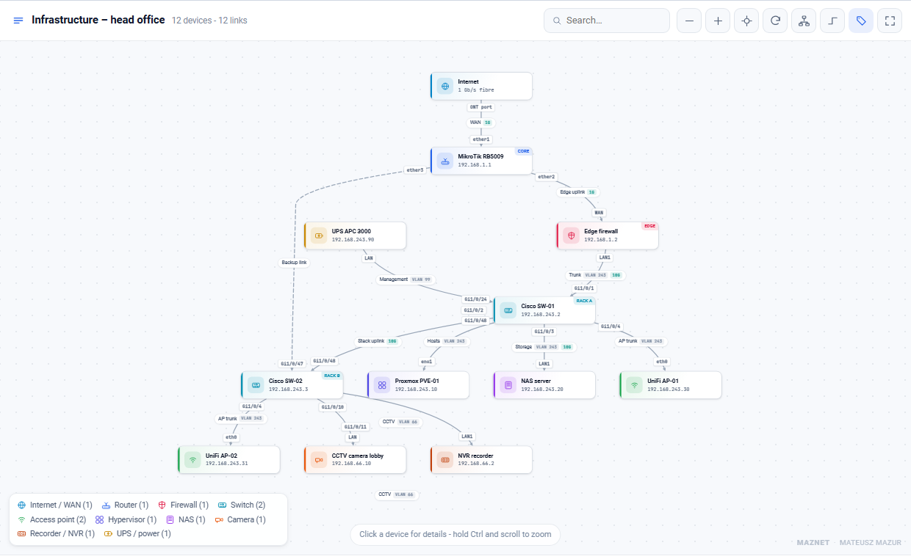
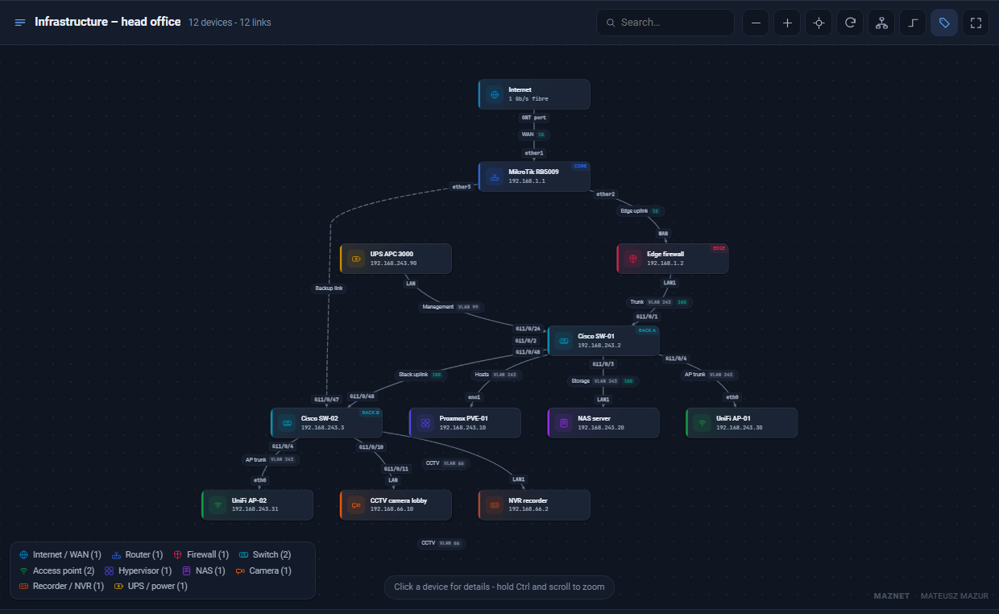
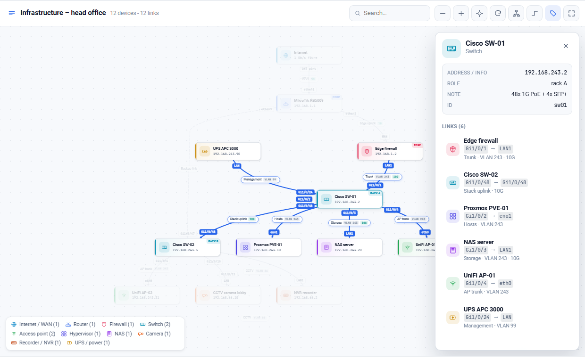
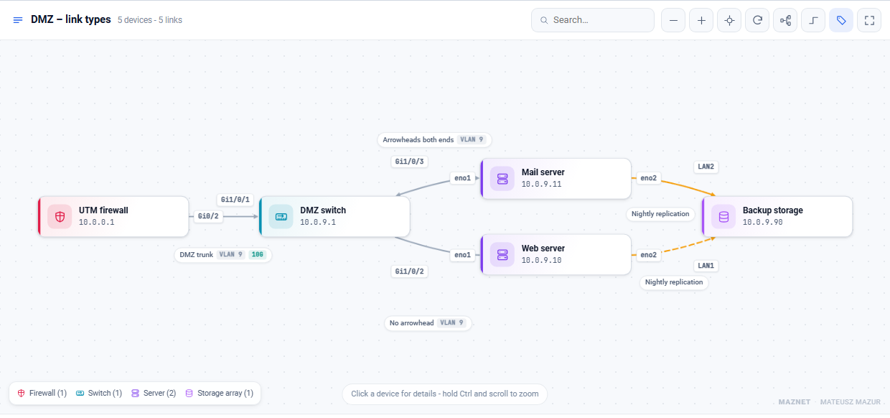
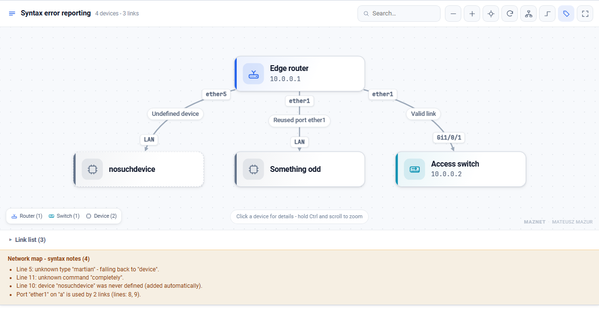

# Network infrastructure maps for Wiki.js

*[Wersja polska](../pl/README.md) · [Repository home](../README.md)*

Interactive network diagrams written as **plain text** inside a Wiki.js page.
Instead of drawing a diagram in an external tool and uploading a picture, you
describe devices and links — including the port on **both** ends of the cable —
and the map lays itself out and becomes clickable.



```html
<pre class="network-map" data-title="Head office network">
node router "MikroTik RB5009" router ip=192.168.1.1
node sw01   "Cisco SW-01"     switch ip=192.168.243.2

router:ether1 -> sw01:Gi1/0/48 "Uplink" vlan=243 speed=10G
</pre>
```

---

## Contents

1. [Features](#features)
2. [Screenshots](#screenshots)
3. [Installation](#installation)
   * [Option A — jsDelivr, straight from GitHub](#option-a--jsdelivr-straight-from-github)
   * [Option B — GitHub Pages](#option-b--github-pages)
   * [Option C — self-hosted files](#option-c--self-hosted-files)
   * [Cytoscape libraries](#cytoscape-libraries)
4. [Syntax](#syntax)
5. [Using the map](#using-the-map)
6. [Script configuration](#script-configuration)
7. [How it works inside](#how-it-works-inside)
8. [Licence](#licence)

---

## Features

* **Ports on both ends of a link** — `router:ether1 -> sw01:Gi1/0/48`. Each label
  is anchored to the right device and a collision-avoidance pass keeps labels
  from overlapping.
* **Layout without crossing lines** — edge routes come from dagre, so long links
  curve around the devices that sit between their endpoints. Parallel links
  (LAG / EtherChannel) are spread apart instead of drawn on top of each other.
* **25 device types** with their own SVG icons and colours — router, firewall,
  switch, patch panel, access point, server, hypervisor, VM, NAS, storage array,
  camera, NVR, intruder alarm, fire panel, sensor, UPS, printer, phone and more.
  Common abbreviations work as aliases (`fw`, `sw`, `ap`, `pve`, `cctv`, `dvr`, `pc`…).
* **Details panel** on click: every link as `port → port`, with descriptions,
  VLANs, speeds and notes; one more click jumps to the device on the other end.
* **Search** across name, IP address, id, role and type.
* **Vertical / horizontal layout**, smooth or orthogonal lines, description
  toggle, fullscreen.
* **Light and dark Wiki.js themes**, touch support, print-friendly output
  (a collapsible table of every link sits under the map — also useful for screen readers).
* **Syntax checking** — the map reports unknown types, links to undefined devices
  and, most usefully, **the same port used by two links**, and still renders.

## Screenshots

| Dark theme | Details panel |
|---|---|
|  |  |

| Horizontal layout and line styles | Syntax notes |
|---|---|
|  |  |

---

## Installation

Everything happens in **Administration → Theme → Code injection**.
Pick one of the three options below.

### Option A — jsDelivr, straight from GitHub

Nothing to upload to your wiki server. jsDelivr serves files directly out of a
GitHub repository with the correct MIME type.

**Head:**

```html
<link rel="stylesheet" href="https://cdn.jsdelivr.net/gh/MowMiMazur/WikiJS-Network-map@v1.0.2/en/network-map.css">
```

**Body** (order matters):

```html
<script src="https://cdn.jsdelivr.net/npm/cytoscape@3.34.0/dist/cytoscape.min.js"></script>
<script src="https://cdn.jsdelivr.net/npm/cytoscape-dagre@3.0.0/cytoscape-dagre.js"></script>
<script src="https://cdn.jsdelivr.net/gh/MowMiMazur/WikiJS-Network-map@v1.0.2/en/network-map.js"></script>
```

Swap `/en/` for `/pl/` to get the Polish user interface.

#### Version in the address

The `@v1.0.2` above pins the release. Swap it for whichever of these suits you:

| Address | What you get |
|---|---|
| `@v1.0.2` | exactly this release, for good. Recommended — nothing changes under your wiki until you edit the address yourself |
| `@1` | the newest `1.x` — fixes and new features arrive on their own, without breaking changes |
| `@latest` | the newest release of any kind, a future `2.x` included, so it may one day want changes on your side |

`@1` and `@latest` are served with a 12-hour CDN cache and a week-long browser
cache, so a fresh release does not land the same minute — a browser that already
holds the file keeps it until that week is up. A pinned address has no such
delay: it is a different address, so it is never anyone's old file.

The [releases page](https://github.com/MowMiMazur/WikiJS-Network-map/releases)
lists what changed in each version.

**Things worth knowing:**

* **`raw.githubusercontent.com` will not work.** GitHub serves those files as
  `Content-Type: text/plain` together with `X-Content-Type-Options: nosniff`,
  so the browser refuses to execute them as a script or stylesheet. You need a
  CDN that rewrites the content type — hence jsDelivr.
* **Stuck on an old file** while using `@1` or `@latest`? Opening this once tells
  jsDelivr to fetch it again, which cuts the CDN half of the wait:

  ```
  https://purge.jsdelivr.net/gh/MowMiMazur/WikiJS-Network-map@1/en/network-map.js
  ```

  Your own browser still needs a hard reload (`Ctrl` + `F5`).
* **An air-gapped wiki** cannot reach any CDN — use option C.

### Option B — GitHub Pages

If you want your own address with no CDN cache in the way:
**Settings → Pages → Deploy from a branch → `main` → `/ (root)`**.
A few minutes later the files are available at:

```html
<link rel="stylesheet" href="https://mowmimazur.github.io/WikiJS-Network-map/en/network-map.css">
<script src="https://mowmimazur.github.io/WikiJS-Network-map/en/network-map.js"></script>
```

GitHub Pages sends the correct MIME type and updates as soon as you push.

### Option C — self-hosted files

The safest option for an internal network: nothing leaves your infrastructure.

1. Download `network-map.js` and `network-map.css` from the `en/` folder of this repository.
2. Download Cytoscape from its official sources (see below).
3. Upload the four files to your wiki assets, for example into `/files`.
4. Code injection:

```html
<!-- Head -->
<link rel="stylesheet" href="/files/network-map.css">
```

```html
<!-- Body -->
<script src="/files/cytoscape.min.js"></script>
<script src="/files/cytoscape-dagre.js"></script>
<script src="/files/network-map.js"></script>
```

### Cytoscape libraries

The map builds on two MIT-licensed libraries. **Take them from their official
sources** rather than from the copies in this repository — that way you get
current releases and security fixes:

| Library | Source | CDN URL |
|---|---|---|
| Cytoscape.js | [github.com/cytoscape/cytoscape.js](https://github.com/cytoscape/cytoscape.js) · [js.cytoscape.org](https://js.cytoscape.org) | `https://cdn.jsdelivr.net/npm/cytoscape@3.34.0/dist/cytoscape.min.js` |
| cytoscape.js-dagre | [github.com/cytoscape/cytoscape.js-dagre](https://github.com/cytoscape/cytoscape.js-dagre) | `https://cdn.jsdelivr.net/npm/cytoscape-dagre@3.0.0/cytoscape-dagre.js` |

`unpkg.com` and `cdnjs.cloudflare.com` serve both packages as well.
The copies in [`../vendor/`](../vendor/) are there for wikis with no route to a CDN.

> **Required versions:** Cytoscape.js **≥ 3.30** and cytoscape.js-dagre **≥ 3.0**.
> The second one matters: the map relies on the `useDagreEdgeControlPoints`
> option introduced in 3.0 — on an older release the lines will run straight
> through the device cards. cytoscape-dagre 3.x bundles dagre, so you do not
> need to load dagre separately.

Once installed, drop a `<pre class="network-map">…</pre>` block into any wiki page
(Markdown mode). The script picks it up on its own, including after client-side
navigation to another page (Wiki.js is a SPA).

---

## Syntax

Full reference: **[SYNTAX.md](SYNTAX.md)** — you can also paste that file into your
own wiki as a help page. A ready-made test page: **[TEST-PAGE.md](TEST-PAGE.md)**.
The essentials:

### Devices

```
node <id> "<Name>" [type] ["Address / info"] [key=value ...]
```

| Attribute | Effect |
|---|---|
| `ip=` / `info=` | second line on the card, usually an IP address |
| `tag=` | corner badge, e.g. `tag="rack A"` |
| `note=` | note shown in the details panel |
| `url=` | link to the wiki page for that device |
| `color=` | override the accent colour |

**Types:** `internet` `cloud` `router` `gateway` `firewall` `switch` `patchpanel`
`wifi` `server` `hypervisor` `vm` `nas` `storage` `computer` `laptop` `printer`
`phone` `display` `camera` `nvr` `alarm` `firepanel` `sensor` `ups` `device`

### Links and ports

```
router:ether1 -> sw01:Gi1/0/48 "Uplink to rack A" vlan=243 speed=10G
internet:"Carrier ONT port" -> router:ether1 "WAN"
```

| Notation | Effect |
|---|---|
| `--` or nothing | plain line, no arrowheads (recommended for LANs) |
| `->` | arrowhead at the target device |
| `<->` | arrowheads on both ends |

| Attribute | Effect |
|---|---|
| `vlan=243` | a "VLAN 243" badge |
| `speed=10G` | a bandwidth badge |
| `style=dashed` \| `dotted` | line style, e.g. a backup link |
| `color=#f59e0b` | custom line colour |
| `porta=` / `portb=` | ports without the colon notation |

The older positional form still works:

```
link router sw01 "Trunk VLAN 243" "ether1" "Gi1/0/48"
```

### Map settings

| Line | Meaning |
|---|---|
| `title "Map name"` | title in the toolbar |
| `direction TB` | vertical (default); `LR` = horizontal, `BT`, `RL` |
| `height 700` | map height in pixels (260–2000) |
| `legend off` | hide the type legend |
| `table off` | hide the link list below the map |

Or on the tag itself: `<pre class="network-map" data-title="…" data-direction="LR" data-height="760">`.

---

## Using the map

| Action | Effect |
|---|---|
| click a device | highlights its links, opens the `port → port` panel |
| click a row in the panel | jumps to the device on the other end |
| click a line | highlights that link alone |
| double-click a device | zooms to its neighbourhood |
| click the background or `Esc` | clears the selection |
| drag a device | moves the card, labels follow the line |
| `Ctrl` + mouse wheel | zoom (without `Ctrl` the page scrolls normally) |

Toolbar, left to right: zoom out, zoom in, fit, re-run layout, vertical/horizontal,
smooth/orthogonal lines, show/hide descriptions, fullscreen.

## Script configuration

The `CFG` object at the top of [network-map.js](network-map.js):

| Field | Meaning |
|---|---|
| `nodeWidth` | device card width |
| `rankSep`, `nodeSep`, `edgeSep` | layout density for small maps |
| `autoSpread` | `false` = fixed separations, no spreading on dense maps |
| `spreadFrom`, `spreadRank`, `spreadNode` | from how many links, and how hard, the map spreads out |
| `fanFrom`, `fanStep` | extra spreading for a wide fan-out from a single device |
| `spreadMax` | upper bound on the spreading |
| `stageHeight` | default map height |
| `fitMaxZoom` | zoom ceiling when fitting small maps |
| `wheelStep`, `buttonStep` | zoom speed |
| `wheelNeedsCtrl` | `false` = the wheel zooms without `Ctrl` |
| `hideDescZoom`, `hidePortZoom` | label fade-out thresholds |
| `parallelShift` | spacing between parallel links |
| `author` | corner credit |

A new device type takes two edits: an SVG path in `ICONS` and an entry in `TYPES`
(label, icon, colour).

## How it works inside

* Layout comes from **dagre** (via `cytoscape-dagre`) with `useDagreEdgeControlPoints`
  enabled — dagre returns a routed path per edge, which is converted into Bézier
  control points for Cytoscape. That is what keeps lines off the device cards.
* Cards, port labels and link descriptions are **not drawn on the canvas**. They
  live in an HTML layer above it, moved by a single CSS transform, so the whole
  look is plain CSS instead of limited canvas styling.
* Labels are positioned by a small collision-avoidance pass: cards act as
  obstacles, port labels outrank descriptions, and candidate positions are tried
  perpendicular to and along the line, with a step scaled to the label size.
* Diagnostics from the browser console:

  ```js
  NetworkMap.parse(document.querySelector('pre.network-map').textContent)
  document.querySelector('.nm-root').__nm   // { cy, doc, select, fitView, layout }
  ```

[TEST-PAGE.md](TEST-PAGE.md) is a ready page that exercises every feature — paste
it into a wiki page to check your installation.

## Licence

**Apache License 2.0** — you may use, modify and redistribute this code, including
commercially and in closed-source projects, as long as the author and licence
information is kept: the [LICENSE](../LICENSE) and [NOTICE](../NOTICE) files and
the headers in the source files.

```
Copyright 2026 Mateusz Mazur (MAZNET)
Licensed under the Apache License, Version 2.0
```

The map shows a discreet author credit in the bottom-right corner; it can be
changed or turned off in `CFG.author`.

Cytoscape.js and cytoscape.js-dagre are MIT licensed and remain the property of
their authors — see [NOTICE](../NOTICE).
