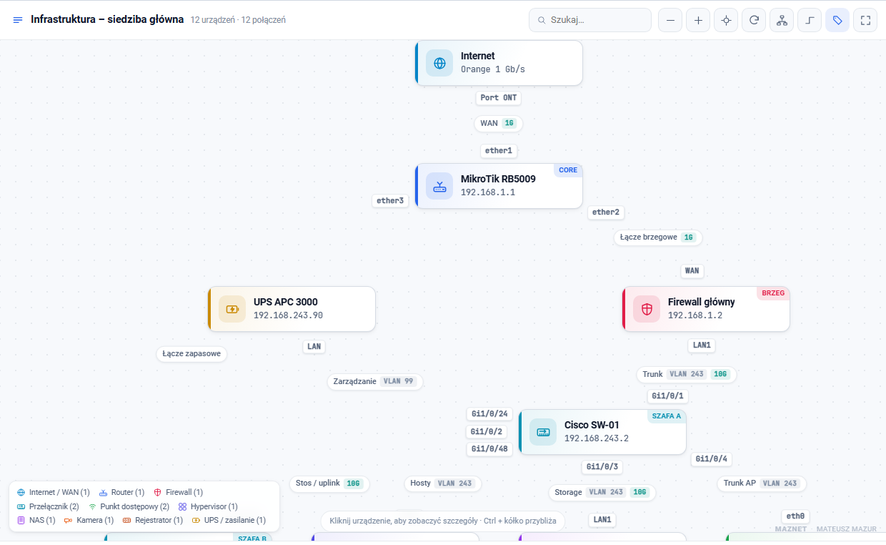
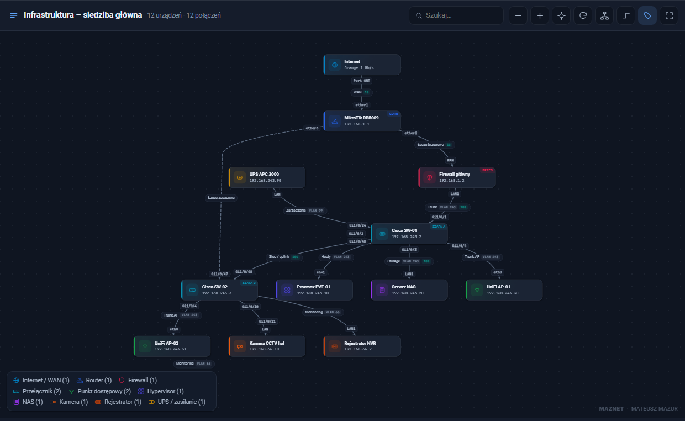
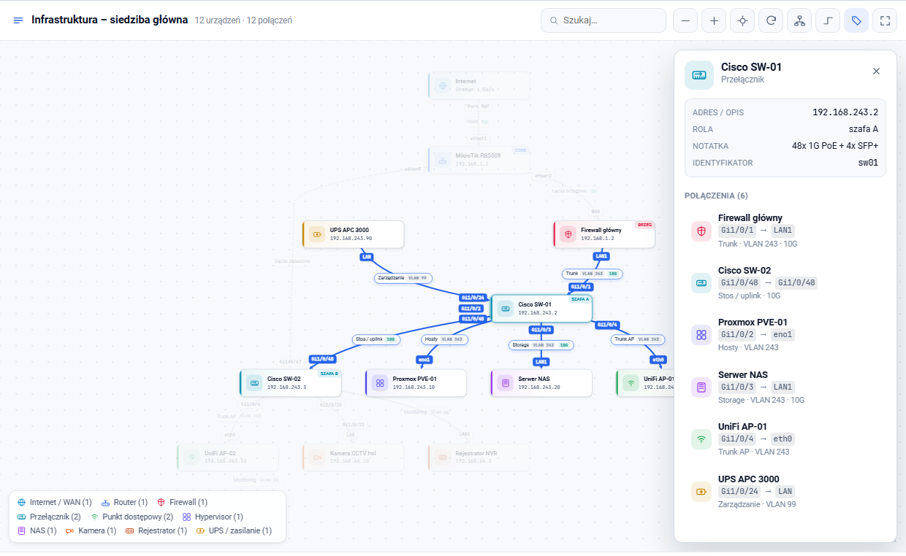
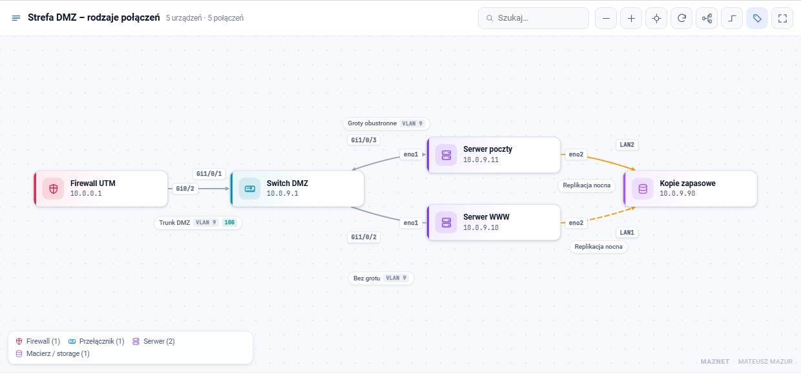
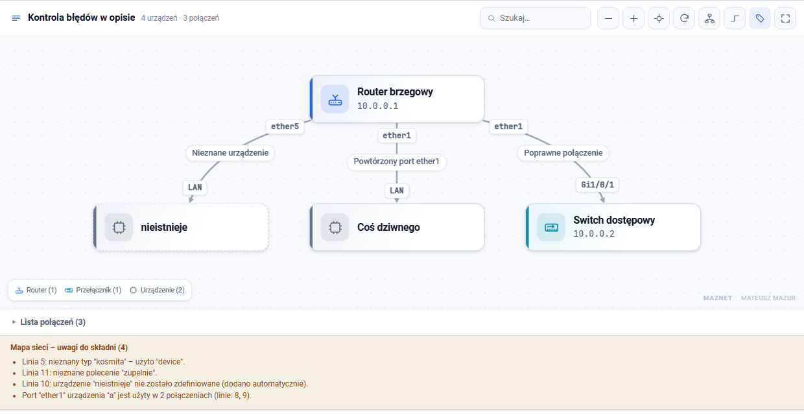

# Mapa infrastruktury sieciowej dla Wiki.js

*[English version](../en/README.md) · [Strona główna repozytorium](../README.md)*

Interaktywne diagramy sieci opisywane **zwykłym tekstem** wewnątrz strony Wiki.js.
Zamiast rysować schemat w zewnętrznym programie i wrzucać obrazek, opisujesz
urządzenia i połączenia — razem z portami po obu stronach kabla — a mapa rysuje
się sama, układa i pozwala kliknąć każde urządzenie.



```html
<pre class="network-map" data-title="Mapa infrastruktury głównej">
node router "MikroTik RB5009" router ip=192.168.1.1
node sw01   "Cisco SW-01"     switch ip=192.168.243.2

router:ether1 -> sw01:Gi1/0/48 "Uplink" vlan=243 speed=10G
</pre>
```

---

## Spis treści

1. [Co potrafi](#co-potrafi)
2. [Podgląd](#podgląd)
3. [Instalacja](#instalacja)
   * [Wariant A — jsDelivr, prosto z GitHuba](#wariant-a--jsdelivr-prosto-z-githuba)
   * [Wariant B — GitHub Pages](#wariant-b--github-pages)
   * [Wariant C — pliki na własnym serwerze](#wariant-c--pliki-na-własnym-serwerze)
   * [Biblioteki Cytoscape](#biblioteki-cytoscape)
4. [Składnia](#składnia)
5. [Obsługa mapy](#obsługa-mapy)
6. [Konfiguracja skryptu](#konfiguracja-skryptu)
7. [Jak to działa w środku](#jak-to-działa-w-środku)
8. [Licencja](#licencja)

---

## Co potrafi

* **Porty po obu stronach połączenia** — `router:ether1 -> sw01:Gi1/0/48`. Etykiety
  trafiają przy właściwe urządzenia, a algorytm unikania kolizji pilnuje, żeby się
  nie nakładały.
* **Układ bez nakładających się linii** — trasy krawędzi wyznacza dagre, więc długie
  połączenia łagodnym łukiem omijają urządzenia stojące w środku mapy. Połączenia
  równoległe (LAG / EtherChannel) są rozsuwane.
* **25 typów urządzeń** z własnymi ikonami SVG i kolorami — router, firewall, switch,
  patchpanel, AP, serwer, hypervisor, VM, NAS, macierz, kamera, NVR, SSWiN, SAP,
  czujnik, UPS, drukarka, telefon i inne. Działają polskie aliasy (`zapora`,
  `przełącznik`, `kamera`, `rejestrator`, `proxmox`…).
* **Panel szczegółów** po kliknięciu urządzenia: lista połączeń `port → port`
  z opisami, VLAN-ami, prędkościami i notatkami; jedno kliknięcie przeskakuje
  do urządzenia po drugiej stronie kabla.
* **Wyszukiwanie** po nazwie, adresie IP, identyfikatorze, roli i typie.
* **Układ pionowy / poziomy**, linie krzywe / kątowe, ukrywanie opisów, pełny ekran.
* **Motyw jasny i ciemny** Wiki.js, obsługa ekranów dotykowych, wersja do druku
  (pod mapą rozwijana tabela wszystkich połączeń — dobra też dla czytników ekranu).
* **Kontrola błędów w opisie** — mapa sama zgłasza nieznany typ, nieistniejące
  urządzenie oraz **ten sam port użyty w dwóch połączeniach**, i mimo błędów
  nadal się rysuje.

## Podgląd

| Motyw ciemny | Panel szczegółów |
|---|---|
|  |  |

| Układ poziomy i rodzaje linii | Uwagi do składni |
|---|---|
|  |  |

---

## Instalacja

Wszystko odbywa się w **Administracja → Wygląd → Wstrzykiwanie kodu**.
Poniżej trzy warianty — wybierz jeden.

### Wariant A — jsDelivr, prosto z GitHuba

Nie musisz nic wgrywać na serwer wiki. jsDelivr udostępnia pliki wprost
z repozytorium GitHub, podając je z poprawnym typem MIME.

**Head:**

```html
<link rel="stylesheet" href="https://cdn.jsdelivr.net/gh/MowMiMazur/WikiJS-Network-map@main/pl/network-map.css">
```

**Body** (kolejność jest istotna):

```html
<script src="https://cdn.jsdelivr.net/npm/cytoscape@3.34.0/dist/cytoscape.min.js"></script>
<script src="https://cdn.jsdelivr.net/npm/cytoscape-dagre@3.0.0/cytoscape-dagre.js"></script>
<script src="https://cdn.jsdelivr.net/gh/MowMiMazur/WikiJS-Network-map@main/pl/network-map.js"></script>
```

Wersję angielską wczytasz podmieniając `/pl/` na `/en/`.

**O czym trzeba wiedzieć:**

* **`raw.githubusercontent.com` nie zadziała.** GitHub podaje te pliki jako
  `Content-Type: text/plain` z nagłówkiem `X-Content-Type-Options: nosniff`,
  więc przeglądarka odmawia wykonania ich jako skryptu i arkusza stylów.
  Potrzebny jest CDN, który podmienia typ zawartości — stąd jsDelivr.
* **`@main` to gałąź**, a jsDelivr trzyma taką odpowiedź w cache do 12 godzin.
  Zmiana w repozytorium nie pojawi się od razu.
* **Do produkcji przypnij tag.** Tag i konkretny commit są niezmienne, więc
  jsDelivr cache’uje je na stałe, a Twoja wiki nie zmieni się nagle sama:

  ```
  https://cdn.jsdelivr.net/gh/MowMiMazur/WikiJS-Network-map@v2.0.0/pl/network-map.js
  ```

  Wydanie tagu w repozytorium:

  ```bash
  git tag v2.0.0
  git push origin v2.0.0
  ```
* **Wymuszenie odświeżenia cache** dla gałęzi — wystarczy raz otworzyć w przeglądarce:

  ```
  https://purge.jsdelivr.net/gh/MowMiMazur/WikiJS-Network-map@main/pl/network-map.js
  ```
* **Wiki w sieci odciętej od internetu** nie wczyta niczego z CDN — użyj wariantu C.

### Wariant B — GitHub Pages

Jeśli chcesz mieć własny, natychmiast aktualizowany adres bez cache CDN:
**Settings → Pages → Deploy from a branch → `main` → `/ (root)`**.
Po kilku minutach pliki są dostępne pod:

```html
<link rel="stylesheet" href="https://mowmimazur.github.io/WikiJS-Network-map/pl/network-map.css">
<script src="https://mowmimazur.github.io/WikiJS-Network-map/pl/network-map.js"></script>
```

GitHub Pages podaje poprawny typ MIME i aktualizuje się od razu po `git push`.

### Wariant C — pliki na własnym serwerze

Najbezpieczniejszy wariant dla sieci wewnętrznych: nic nie wychodzi na zewnątrz.

1. Pobierz `network-map.js` i `network-map.css` z folderu `pl/` tego repozytorium.
2. Pobierz Cytoscape z oficjalnych źródeł (patrz niżej).
3. Wgraj cztery pliki do zasobów wiki, np. do folderu `/pliki`.
4. Wstrzyknięcie kodu:

```html
<!-- Head -->
<link rel="stylesheet" href="/pliki/network-map.css">
```

```html
<!-- Body -->
<script src="/pliki/cytoscape.min.js"></script>
<script src="/pliki/cytoscape-dagre.js"></script>
<script src="/pliki/network-map.js"></script>
```

### Biblioteki Cytoscape

Mapa korzysta z dwóch bibliotek na licencji MIT. **Pobieraj je z oficjalnych
źródeł**, a nie z kopii w tym repozytorium — dostaniesz aktualne wydania
i poprawki bezpieczeństwa:

| Biblioteka | Źródło | Adres CDN |
|---|---|---|
| Cytoscape.js | [github.com/cytoscape/cytoscape.js](https://github.com/cytoscape/cytoscape.js) · [js.cytoscape.org](https://js.cytoscape.org) | `https://cdn.jsdelivr.net/npm/cytoscape@3.34.0/dist/cytoscape.min.js` |
| cytoscape.js-dagre | [github.com/cytoscape/cytoscape.js-dagre](https://github.com/cytoscape/cytoscape.js-dagre) | `https://cdn.jsdelivr.net/npm/cytoscape-dagre@3.0.0/cytoscape-dagre.js` |

Działają też `unpkg.com` i `cdnjs.cloudflare.com`.
Kopie w folderze [`../vendor/`](../vendor/) są tylko wygodą na potrzeby testów offline.

> **Wymagane wersje:** Cytoscape.js **≥ 3.30** i cytoscape.js-dagre **≥ 3.0**.
> Ta druga jest istotna: mapa używa opcji `useDagreEdgeControlPoints`, która
> pojawiła się w wydaniu 3.0 — na starszej wersji linie będą przechodzić przez kafle.
> Wersja `cytoscape-dagre` 3.x ma dagre wbudowany, nie trzeba go dołączać osobno.

Po instalacji wstaw na dowolnej stronie wiki (tryb Markdown) blok
`<pre class="network-map">…</pre>`. Skrypt sam go znajdzie, także po przejściu
na inną stronę bez przeładowania (Wiki.js działa jako SPA).

---

## Składnia

Pełny opis: **[SKLADNIA.md](SKLADNIA.md)** — możesz też wkleić ten plik jako
stronę pomocy we własnej wiki. Gotowa strona testowa: **[STRONA-TESTOWA.md](STRONA-TESTOWA.md)**.
Skrót najważniejszych rzeczy:

### Urządzenia

```
node <id> "<Nazwa>" [typ] ["Adres / opis"] [klucz=wartość ...]
```

| Atrybut | Działanie |
|---|---|
| `ip=` / `info=` | druga linijka na kaflu, zwykle adres IP |
| `tag=` | plakietka w narożniku, np. `tag="szafa A"` |
| `note=` | notatka w panelu szczegółów |
| `url=` | link do strony wiki tego urządzenia |
| `color=` | wymuszony kolor akcentu |

**Typy:** `internet` `cloud` `router` `gateway` `firewall` `switch` `patchpanel`
`wifi` `server` `hypervisor` `vm` `nas` `storage` `computer` `laptop` `printer`
`phone` `display` `camera` `nvr` `alarm` `firepanel` `sensor` `ups` `device`

### Połączenia i porty

```
router:ether1 -> sw01:Gi1/0/48 "Uplink do szafy A" vlan=243 speed=10G
internet:"Port ONT operatora" -> router:ether1 "WAN"
```

| Zapis | Efekt |
|---|---|
| `--` lub brak | linia bez grotów (zalecane w sieciach LAN) |
| `->` | grot przy urządzeniu docelowym |
| `<->` | groty z obu stron |

| Atrybut | Działanie |
|---|---|
| `vlan=243` | plakietka „VLAN 243” |
| `speed=10G` | plakietka z przepustowością |
| `style=dashed` \| `dotted` | rodzaj linii, np. łącze zapasowe |
| `color=#f59e0b` | własny kolor linii |
| `porta=` / `portb=` | porty bez zapisu z dwukropkiem |

Działa też starszy zapis pozycyjny:

```
link router sw01 "Trunk VLAN 243" "ether1" "Gi1/0/48"
```

### Ustawienia mapy

| Linia | Znaczenie |
|---|---|
| `title "Nazwa mapy"` | tytuł w pasku |
| `direction TB` | pionowo (domyślnie); `LR` = poziomo, `BT`, `RL` |
| `height 700` | wysokość mapy w pikselach (260–2000) |
| `legend off` | bez legendy typów |
| `table off` | bez listy połączeń pod mapą |

Alternatywnie w znaczniku: `<pre class="network-map" data-title="…" data-direction="LR" data-height="760">`.

---

## Obsługa mapy

| Akcja | Efekt |
|---|---|
| klik na urządzeniu | wyróżnia połączenia, otwiera panel z listą `port → port` |
| klik na pozycji w panelu | przeskakuje do urządzenia po drugiej stronie |
| klik na linii | wyróżnia samo połączenie |
| dwuklik na urządzeniu | przybliża do jego otoczenia |
| klik w tło lub `Esc` | czyści zaznaczenie |
| przeciąganie urządzenia | przesuwa kafel razem z etykietami |
| `Ctrl` + kółko myszy | przybliżanie (bez `Ctrl` strona przewija się normalnie) |

Pasek narzędzi, od lewej: pomniejsz, powiększ, wyśrodkuj, ułóż ponownie,
układ pion/poziom, linie krzywe/kątowe, pokaż/ukryj opisy, pełny ekran.

## Konfiguracja skryptu

Obiekt `CFG` na początku [network-map.js](network-map.js):

| Pole | Znaczenie |
|---|---|
| `nodeWidth` | szerokość kafla urządzenia |
| `rankSep`, `nodeSep`, `edgeSep` | gęstość układu małych map |
| `autoSpread` | `false` = stałe odstępy, bez rozsuwania gęstych map |
| `spreadFrom`, `spreadRank`, `spreadNode` | od ilu połączeń i jak mocno mapa się rozsuwa |
| `fanFrom`, `fanStep` | dodatkowe rozsunięcie przy szerokim wachlarzu z jednego urządzenia |
| `spreadMax` | górny limit rozsunięcia |
| `stageHeight` | domyślna wysokość mapy |
| `fitMaxZoom` | maksymalne przybliżenie przy dopasowaniu małych map |
| `wheelStep`, `buttonStep` | szybkość przybliżania |
| `wheelNeedsCtrl` | `false` = kółko przybliża bez `Ctrl` |
| `hideDescZoom`, `hidePortZoom` | progi wygaszania etykiet |
| `parallelShift` | rozsunięcie połączeń równoległych |
| `author` | podpis w narożniku mapy |

Nowy typ urządzenia dodaje się w dwóch miejscach: ścieżka SVG w `ICONS`
i wpis w `TYPES` (etykieta, ikona, kolor).

## Jak to działa w środku

* Układ liczy **dagre** (przez `cytoscape-dagre`), z opcją
  `useDagreEdgeControlPoints` — dagre zwraca policzoną trasę każdej krawędzi,
  a ta jest przekładana na punkty kontrolne krzywej Béziera w Cytoscape.
  Dlatego linie nie przechodzą przez kafle.
* Kafle, etykiety portów i opisy połączeń **nie są rysowane na canvasie**, tylko
  jako warstwa HTML nad nim, przesuwana jedną transformacją CSS. Cała oprawa
  graficzna to zwykły CSS, a nie ograniczone stylowanie canvasa.
* Etykiety rozstawia własny algorytm unikania kolizji: kafle są przeszkodami,
  porty mają priorytet nad opisami, a kandydatów na pozycję szuka się prostopadle
  i wzdłuż linii, z krokiem zależnym od rozmiaru etykiety.
* Diagnostyka w konsoli przeglądarki:

  ```js
  NetworkMap.parse(document.querySelector('pre.network-map').textContent)
  document.querySelector('.nm-root').__nm   // { cy, doc, select, fitView, layout }
  ```

Lokalny podgląd bez wiki: otwórz [test.html](test.html) wprost z pliku.

## Licencja

**Apache License 2.0** — możesz używać, zmieniać i rozpowszechniać ten kod, także
komercyjnie i w projektach zamkniętych, pod warunkiem zachowania informacji
o autorze i licencji: plików [LICENSE](../LICENSE) i [NOTICE](../NOTICE) oraz
nagłówków w plikach źródłowych.

```
Copyright 2026 Mateusz Mazur (MAZNET)
Licensed under the Apache License, Version 2.0
```

Mapa wyświetla dyskretny podpis autora w prawym dolnym narożniku; można go
zmienić lub wyłączyć w `CFG.author`.

Cytoscape.js i cytoscape.js-dagre są objęte licencją MIT i pozostają własnością
swoich autorów — szczegóły w [NOTICE](../NOTICE).
